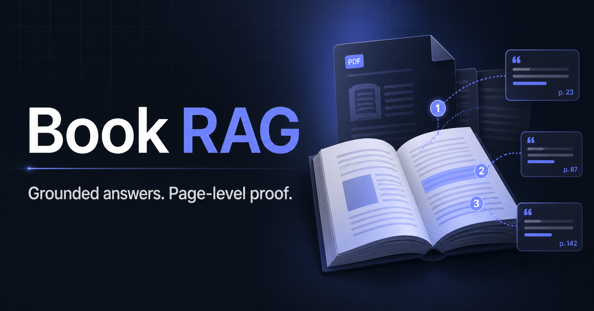

# Book RAG

**Ask questions across PDF books and get grounded answers with page-level evidence.**

[Open the live app](https://d1n9699wkr1rp7.cloudfront.net) · [API guide](docs/api.md) · [Architecture](docs/architecture.md) · [Deployment](docs/deployment.md)



Book RAG is a production-oriented retrieval-augmented generation application. Users can create an account, upload PDFs, organize a private document library, and have multi-turn conversations backed by selected books. The application returns citations for the exact source, page, and chunk used to produce each answer.

## Highlights

- Professional responsive Next.js interface with light/dark themes and mobile navigation
- Private, user-scoped document libraries and chat histories
- PDF validation, extraction, cleaning, recursive chunking, and persistent indexing
- BGE query/document embeddings with document-scoped ChromaDB search
- Cross-encoder reranking plus calibrated vector/reranker score fusion
- Relevance gating and a grounded prompt that treats document text as untrusted data
- Page-level source citations and an explicit no-context fallback
- Local Ollama generation for development and Amazon Bedrock Nova for AWS
- Fully managed AWS deployment through Terraform
- Strict Ruff, mypy, pytest, ESLint, and production-build quality gates

## How it works

```text
PDF upload
  -> page extraction -> cleaning -> recursive chunks
  -> BGE document embeddings -> ChromaDB + EFS

Question + selected documents
  -> BGE query embedding -> candidate retrieval
  -> cross-encoder reranking -> calibrated score fusion
  -> relevance gate -> grounded prompt
  -> Ollama (local) or Amazon Bedrock (AWS)
  -> answer + page citations -> PostgreSQL
```

The AWS environment serves one HTTPS origin through CloudFront. An Application Load Balancer routes `/api/*` to FastAPI and all other requests to Next.js. Both ECS Fargate services run in private subnets; PostgreSQL is hosted in RDS, vector/upload data is mounted from encrypted EFS, secrets come from Secrets Manager, and Bedrock is reached through a private VPC endpoint.

## Technology

| Area | Stack |
|---|---|
| Web | Next.js 16, React 19, TypeScript, Tailwind CSS, shadcn/ui |
| API | Python 3.12, FastAPI, Pydantic, SQLAlchemy, Alembic |
| Retrieval | BAAI BGE, ChromaDB, sentence-transformers cross-encoder |
| Generation | Ollama/Llama locally; Amazon Bedrock Nova on AWS |
| Data | PostgreSQL, ChromaDB, EFS |
| Infrastructure | Docker, ECR, ECS Fargate, ALB, CloudFront, RDS, EFS, Terraform |
| Quality | Ruff, strict mypy, pytest, ESLint, Next.js production build |

## Run locally

### Prerequisites

- Python 3.12 and [uv](https://docs.astral.sh/uv/)
- Node.js 22 and npm
- PostgreSQL 16
- Ollama with `llama3.2`

```bash
git clone https://github.com/UsmanAhamed12/book-rag-llama2.git
cd book-rag-llama2
cp .env.example .env
uv sync --dev
ollama pull llama3.2
uv run alembic upgrade head
uv run uvicorn app.main:app --reload
```

In another terminal:

```bash
cd frontend
npm ci
npm run dev
```

Open `http://localhost:3000`. The API runs at `http://localhost:8000`, with interactive OpenAPI documentation at `http://localhost:8000/docs`.

For a containerized local environment:

```bash
docker compose --env-file .env -f docker/docker-compose.yml up -d --build
```

See [Getting Started](docs/getting-started.md) and [Docker](docs/docker.md) for configuration and troubleshooting.

## Configuration

The checked-in [.env.example](.env.example) is the source of truth for local settings. Important controls include:

```env
LLM_PROVIDER=ollama
OLLAMA_MODEL=llama3.2
EMBEDDING_MODEL=BAAI/bge-small-en-v1.5
RERANKING_ENABLED=true
RETRIEVAL_CANDIDATE_K=20
RERANKER_WEIGHT=0.7
RETRIEVAL_MINIMUM_SCORE=0.35
```

AWS overrides the provider with `LLM_PROVIDER=bedrock` and uses the configured Bedrock inference profile. Never commit `.env`, secret values, uploaded PDFs, database dumps, or vector data.

## Quality gates

```bash
uv run ruff check app tests scripts alembic
uv run ruff format --check app tests scripts alembic
uv run mypy app tests
uv run pytest -q

cd frontend
npm run lint
npm run build -- --webpack
```

Terraform validation:

```bash
terraform -chdir=infra/terraform/environments/dev fmt -check -recursive
terraform -chdir=infra/terraform/environments/dev validate
```

## Documentation

- [Architecture](docs/architecture.md)
- [RAG pipeline](docs/rag-pipeline.md)
- [AWS deployment](docs/deployment.md)
- [Getting started](docs/getting-started.md)
- [Development](docs/development.md)
- [API](docs/api.md)
- [Database](docs/database.md)
- [Authentication](docs/authentication.md)
- [Security](docs/security.md)
- [Testing](docs/testing.md)
- [Troubleshooting](docs/troubleshooting.md)
- [Roadmap](docs/roadmap.md)

## Status

The development environment is live on AWS at [d1n9699wkr1rp7.cloudfront.net](https://d1n9699wkr1rp7.cloudfront.net). It is suitable for demonstrations and controlled testing; review the production-hardening checklist in the security and deployment guides before handling sensitive or high-volume workloads.
